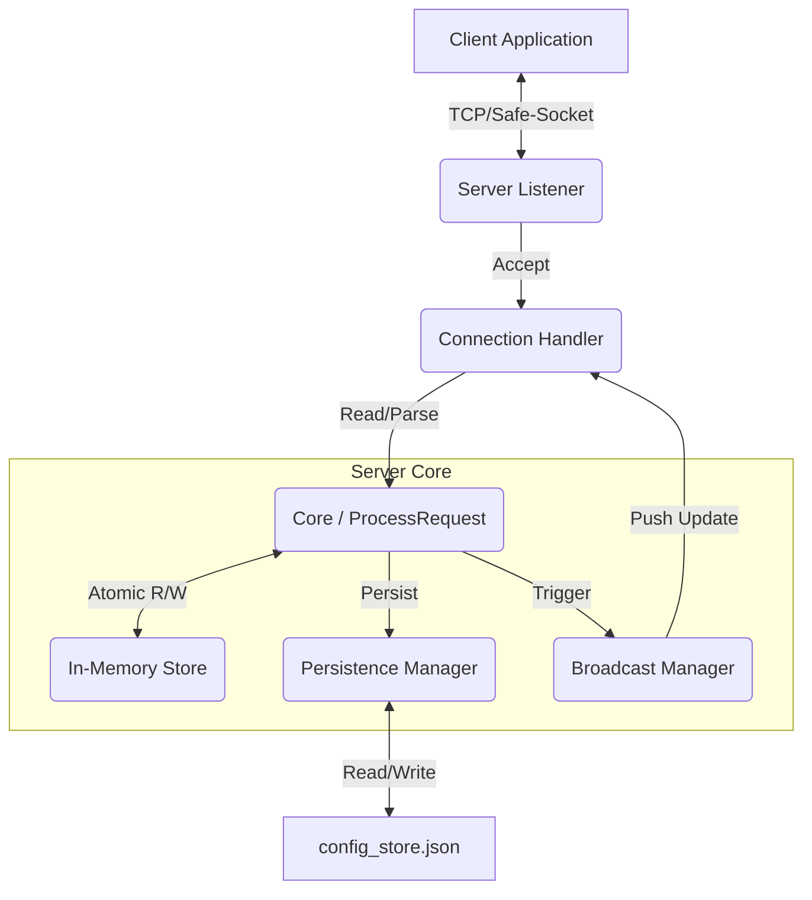

# Config Server Architecture

This document provides a technical deep-dive into the architecture of the `config-server` project.

## High-Level Overview

The Config Server is designed as a centralized, high-performance configuration management system. Its primary goals are:
- **Atomicity**: Configuration updates are atomic to prevent partial reads.
- **Real-Time Distribution**: Updates are pushed to connected clients immediately.
- **Reliability**: Uses a robust framed TCP protocol with handshake verification.

## Component Architecture

### 1. Network Layer (`safe-socket`)
The server delegates low-level networking to the **[safe-socket](https://github.com/Bastien-Antigravity/safe-socket)** library.
- **Profile**: `tcp-hello`
- **Features**: 
  - **Handshake**: Enforces an identity exchange (Name/Group) immediately after connection. Uses `facade.EnvelopedConnection` (or equivalent profile logic).
  - **Framing**: Uses 4-byte Big-Endian length prefixes to distinguish message boundaries.
  - **Reconnection**: Handled by the client-side of the library (Server logic is passive/accept-loop).

### 2. Server Logic (`src/server`)
- **Lifecycle**: `Server.Start()` initializes the listener based on capabilities defined in `distributed-config`.
- **Connection Handling**: Each client connection is handled in a dedicated goroutine (`handleConnection`).
- **Broadcasting**: The server maintains a thread-safe map of active listeners (`listenersLock`). When a configuration update occurs, the server iterates through this map to push the new state.

### 3. Core Logic (`src/core`)
- **Request Processing**: `ProcessRequest` acts as the dispatcher. It deserializes the `ConfigMsg` (Protobuf), determines the operation type (Get, Update, Dump), and interacts with the Store.
- **Statelessness**: The core logic is largely stateless, relying on the `Store` for state management.

### 4. Storage Layer (`src/store`)
- **Data Structure**: `ConfigMap` (map[string]string).
- **Concurrency**:
  - Uses `atomic.Value` or `sync.RWMutex` (depending on implementation version) to swap the entire configuration map pointer. 
  - Readers get a consistent snapshot of the configuration at a point in time without blocking writers.
  - Writers verify and swap the pointer atomically (Cow mechanics often used).
- **Persistence**: A simple JSON file dumper (`PersistenceManager`) ensures configuration survives restarts.

## Data Flow

### Configuration Update Flow
1. **Client** sends `update_mem_config` message with new key/value pairs.
2. **Server** receives payload and passes it to `core.ProcessRequest`.
3. **Core** applies updates to a *copy* of the current configuration.
4. **Store** atomically swaps the global configuration pointer to the new copy.
5. **Persistence** writes the new state to `config_store.json`.
6. **Broadcaster** constructs a `propagate_mem_config` message and sends it to all connected TCP sockets.

### Client Handshake Flow
1. **Client** connects.
2. **Safe-Socket** performs internal handshake (version/identity exchange).
3. **Server** validates the identity.
4. **Server** registers the client in the `listeners` map.
5. **Server** waits for incoming request loop.

## Dependencies

- **distributed-config**: Provides the `ConfigMsg` Protobuf definitions and configuration capabilities (IP/Port).
- **safe-socket**: Handles TCP transport, framing, and strict connection validity.
- **flexible-logger**: Provides structured logging (Remote dependencies).
