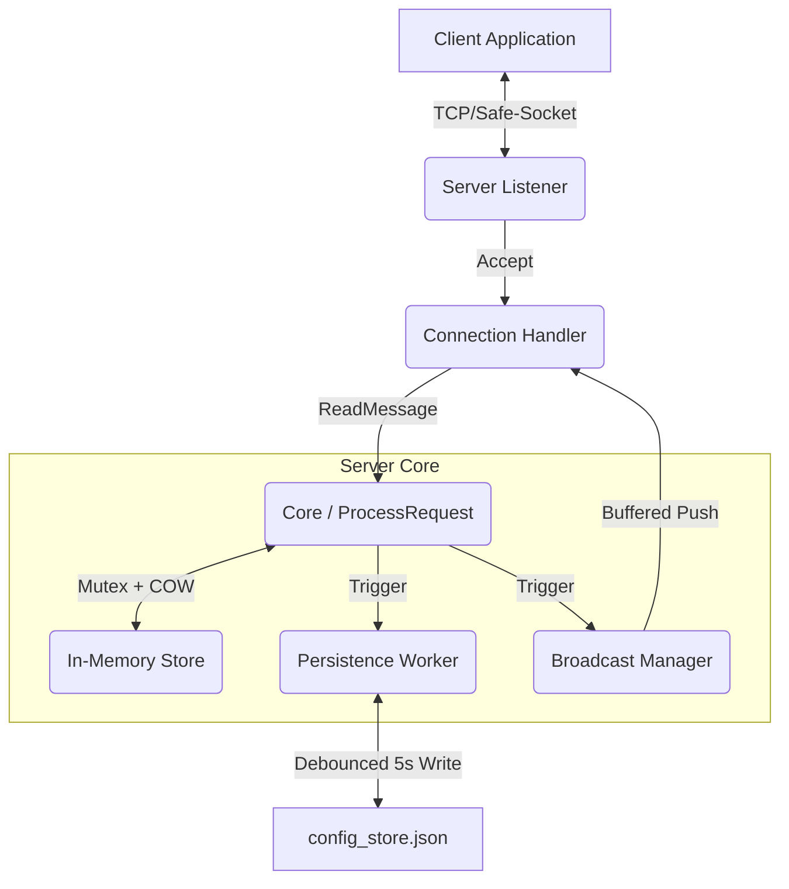

# Config Server Architecture

This document provides a technical deep-dive into the architecture of the `config-server` project.

## High-Level Overview

The Config Server is designed as a centralized, high-performance configuration management system. Its primary goals are:
- **Atomicity**: Configuration updates are atomic (Copy-On-Write) to prevent partial reads or half-migrated states.
- **Real-Time Distribution**: Updates are pushed to connected clients immediately via non-blocking mailboxes.
- **Reliability**: Uses a robust framed TCP protocol with handshake verification and instance-aware identity management.

## Component Architecture

```mermaid
graph TD
    Client[Client Application] <-->|TCP/Safe-Socket| ServerSocket(Server Listener)
    ServerSocket -->|Accept| ConnectionHandler(Connection Handler)
    ConnectionHandler -->|ReadMessage| RequestHandler(Core / ProcessRequest)
    
    subgraph "Server Core"
        RequestHandler <-->|Mutex + COW| Store(In-Memory Store)
        RequestHandler -->|Trigger| Persistence(Persistence Worker)
        RequestHandler -->|Trigger| Broadcaster(Broadcast Manager)
    end
    
    Broadcaster -->|Buffered Push| ConnectionHandler
    Persistence <-->|Debounced 5s Write| Disk[config_store.json]
```

### 1. Network Layer (`safe-socket`)
The server delegates low-level networking to the **[safe-socket](https://github.com/Bastien-Antigravity/safe-socket)** library.
- **Profile**: `tcp-hello`
- **Features**: 
  - **Handshake**: Enforces an identity exchange (Name/Group) immediately after connection.
  - **Framing**: Handled via `ReadMessage()`, ensuring complete protocol frames are processed.
  - **Resource Management**: Implements a 10-minute `IdleTimeout` to prune zombie connections.
  - **Reconnection**: Handled by the client-side of the library.

### 2. Server Logic (`src/server`)
- **Lifecycle**: `Server.Start()` initializes the listener and starts the background `persistenceWorker`.
- **Broadcast System**: Uses a **Per-Client Mailbox Pattern** with tight buffers (3 messages max). Outgoing writes are handled in dedicated goroutines to prevent slow clients from blocking the server.
- **Identity Management**: Uses stable `Service-IP` identification. `removeListener` uses pointer comparison to protect against "ghost disconnections" during rapid service restarts.

### 3. Core Logic (`src/core`)
- **Request Processing**: `ProcessRequest` acts as the dispatcher. It deserializes the `ConfigMsg` (Protobuf) and interacts with the Store.
- **Asynchronous Rituals**: Commands like `PUT_SYNC` trigger non-blocking broadcasts and debounced persistence saving.

### 4. Storage Layer (`src/store`)
- **Data Structure**: `ConfigMap` (map[string]map[string]string).
- **Concurrency**:
  - Uses `sync.RWMutex` to protect nested map structures.
  - **Copy-On-Write (COW)**: `Get()` provides zero-allocation direct access (fast path). `UpdateAtomic()` creates a sandbox copy, ensuring existing readers are never exposed to intermediate states.
- **Persistence**: A debounced background worker (`persistenceWorker`) writes the state to disk at most once every 5 seconds if marked as `dirty`.

## Data Flow

### Configuration Update Flow
1. **Client** sends `PUT_SYNC` message with new section/key/value pairs.
2. **Server** receives payload via `ReadMessage()` and passes it to `core.ProcessRequest`.
3. **Core** applies updates to a **sandbox copy** of the current configuration.
4. **Store** commits the new version if the update function succeeds.
5. **Persistence** marks the state as `dirty`. The background worker performs an atomic write to `config_store.json` on the next ticker cycle (5s).
6. **Broadcaster** constructs a `BROADCAST_SYNC` message and pushes it into each client's mailbox.

### Client Handshake Flow
1. **Client** connects.
2. **Safe-Socket** performs internal handshake (version/identity exchange).
3. **Server** validates the identity and extracts the host (stripping dynamic ports).
4. **Server** registers a new `clientMailbox` in the `listeners` map.
5. **Server** enters the `ReadMessage()` loop.

## Dependencies

- **distributed-config**: Provides the `ConfigMsg` Protobuf definitions and configuration schemas.
- **safe-socket**: Handles TCP transport, framing, and strict connection validity.
- **universal-logger**: Provides centralized, structured logging for all layers.
